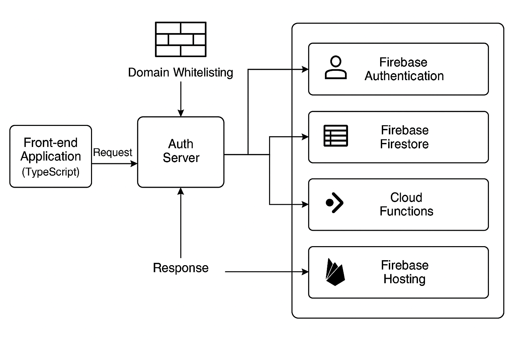

## High-Level Design: maahita Auth Server (TypeScript + Firebase)

### 1. Overview
The maahita Auth Server provides authentication and user management services. This document outlines the high-level design for implementing the same solution using TypeScript and Firebase, leveraging Firebase's serverless architecture, real-time database, and authentication services.

---

### 2. Architecture
The new solution will adopt a **serverless architecture** with Firebase as the backend platform. Key components include:
- **Firebase Authentication**: Handles user authentication (email/password, social logins, etc.).
- **Firebase Firestore**: Stores user data and other application-specific information.
- **Cloud Functions**: Implements custom business logic and APIs.
- **Firebase Hosting**: Serves the frontend application (if applicable).

---

### 3. Core Components
#### 3.1 Authentication
- **Firebase Authentication** will replace the custom authentication logic.
- Supports multiple authentication methods:
  - Email/Password
  - Google, Facebook, and other OAuth providers
  - Anonymous authentication (if needed)
- Firebase SDK will be used in the frontend to handle authentication flows.

#### 3.2 User Management
- User data will be stored in **Firestore**.
- Firestore will include a `users` collection with the following schema:
  ```json
  {
    "id": "unique_user_id",
    "username": "string",
    "email": "string",
    "passwordHash": "string (if needed)",
    "createdAt": "timestamp",
    "updatedAt": "timestamp"
  }
  ```
- Cloud Functions will handle user-related operations like:
  - Creating a new user
  - Fetching user details
  - Updating user information

#### 3.3 Authorization
- Role-based access control (RBAC) will be implemented using custom claims in Firebase Authentication.
- Example roles:
  - `admin`
  - `user`
- Cloud Functions will validate roles and permissions for API requests.

#### 3.4 APIs
- APIs will be implemented using **Firebase Cloud Functions**.
- Example APIs:
  - `POST /users`: Create a new user
  - `GET /users/:id`: Fetch user details
  - `PUT /users/:id`: Update user information
- APIs will use Firebase Authentication for securing endpoints.

- When a user registers with the auth server, the server will send the following response:
  ```json
  {
      "id": "unique_user_id",
      "username": "string",
      "email": "string",
      "createdAt": "timestamp",
      "updatedAt": "timestamp"
  }
  ```

- When a user logs in successfully, the server will send the following response:
  ```json
  {
      "token": "jwt_token_here"
  }
  ```

---

### 4. Technology Stack
- **Backend**: Firebase (Authentication, Firestore, Cloud Functions)
- **Frontend**: TypeScript (React, Angular, or Vue.js)
- **Hosting**: Firebase Hosting
- **Testing**: Jest (for unit tests), Firebase Emulator Suite (for integration tests)

---

### 5. Data Flow
1. **User Registration**:
   - User submits registration details via the frontend.
   - Firebase Authentication creates the user.
   - Cloud Function adds user details to Firestore.

2. **User Login**:
   - User logs in via Firebase Authentication.
   - Firebase issues a JWT token for the session.

3. **API Access**:
   - Frontend sends requests to Cloud Functions with the JWT token.
   - After a successful login, the API will generate a JWT (JSON Web Token) containing the following claims:
     - **User Details**: Includes user ID, username, and email.
     - **Roles**: Specifies the user's roles (e.g., `admin`, `user`).
     - **Expiration Date**: Specifies the token's validity period.
     - **Domain**: Indicates the authorized domain (e.g., `maahita.com`).
     - **Custom Claims**: Any additional claims required for role-based access control (RBAC) or other application-specific purposes.
   - The JWT will be signed using a secure key and returned to the client.
   - Cloud Function validates the token and processes the request.

---

### 6. Advantages of Firebase
- **Scalability**: Serverless architecture scales automatically with demand.
- **Reduced Maintenance**: No need to manage servers or databases.
- **Built-in Security**: Firebase Authentication and Firestore security rules simplify securing the application.
- **Real-time Capabilities**: Firestore provides real-time data synchronization.

---

### 7. Security Considerations
- Restrict access to Firebase resources to authorized maahita domains only.
  - Use Firebase Authentication's domain whitelisting feature to allow only specific domains (e.g., `maahita.com`).
  - Configure Firestore security rules to validate requests based on the authenticated user's email domain.
  - Example Firestore security rule:
    ```
    match /databases/{database}/documents {
      match /users/{userId} {
        allow read, write: if request.auth.token.email_verified &&
                          request.auth.token.email.matches(/@maahita\.com$/);
      }
    }
    ```
- Ensure that only maahita domains are allowed as origins for CORS (Cross-Origin Resource Sharing).
  - Configure Firebase Hosting to restrict allowed origins to `*.maahita.com`.
  - Example Firebase Hosting configuration:
    ```json
    {
      "hosting": {
        "headers": [
          {
            "source": "**",
            "headers": [
              {
                "key": "Access-Control-Allow-Origin",
                "value": "https://*.maahita.com"
              }
            ]
          }
        ]
      }
    }
    ```
- Ensure that the backend auth server processes requests only from maahita domains.
  - Implement middleware in Firebase Cloud Functions to validate the `Origin` header of incoming requests.
  - Example middleware logic:
    ```typescript
    import { Request, Response, NextFunction } from 'express';

    const allowedOrigins = ['https://maahita.com', 'https://*.maahita.com'];

    export function validateOrigin(req: Request, res: Response, next: NextFunction) {
      const origin = req.headers.origin;
      if (origin && allowedOrigins.some((allowed) => origin.match(allowed))) {
        next();
      } else {
        res.status(403).send('Forbidden: Origin not allowed');
      }
    }
    ```
  - Apply this middleware to all API routes in the Firebase Cloud Functions entry point.

  ## High level architecture diagram.
  