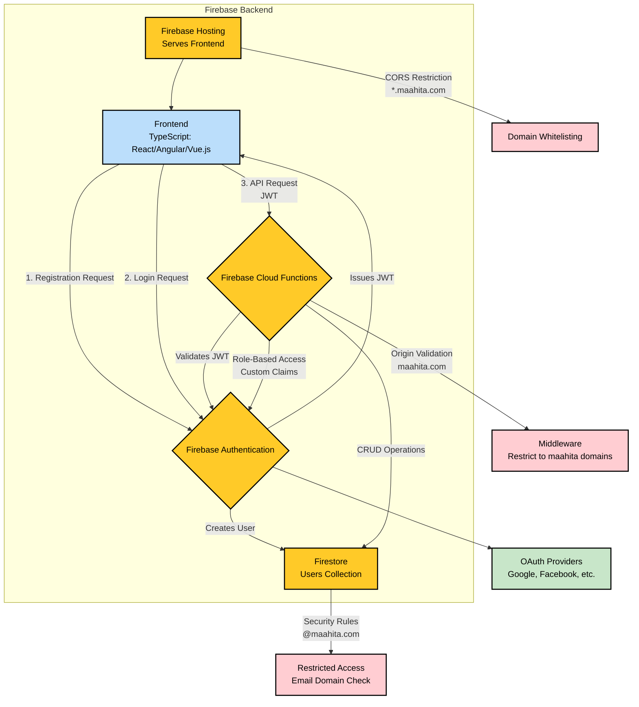
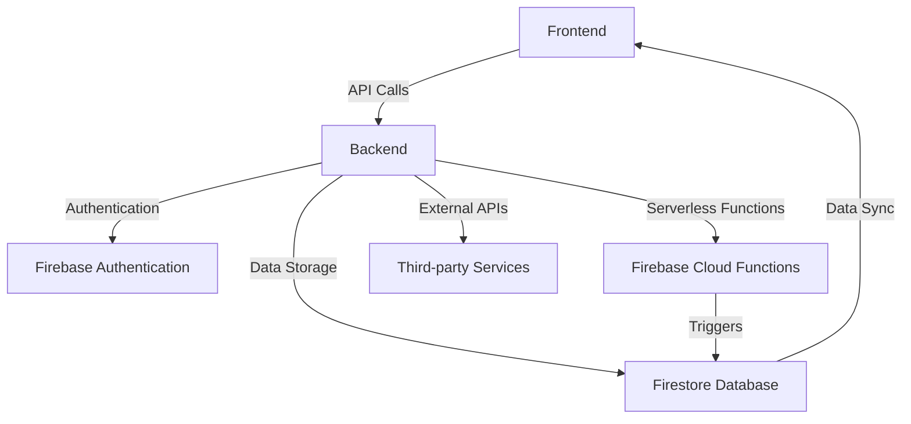
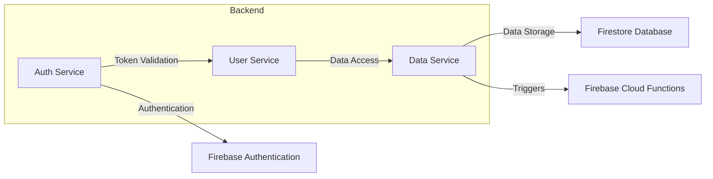
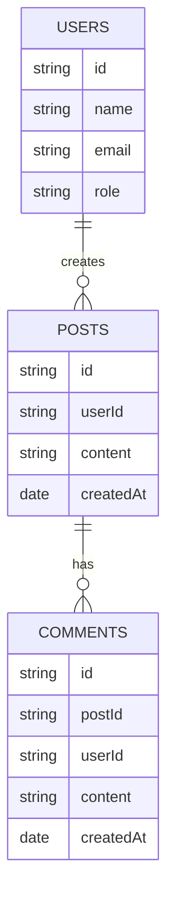

```mermaid
graph TD
    %% Frontend
    A[Frontend<br>TypeScript: React/Angular/Vue.js] -->|1. Registration Request| B{Firebase Authentication}
    A -->|2. Login Request| B
    A -->|3. API Request<br>JWT| C{Firebase Cloud Functions}

    %% Firebase Backend
    subgraph Firebase Backend
        B -->|Creates User| D[Firestore<br>Users Collection]
        B -->|Issues JWT| A
        C -->|Validates JWT| B
        C -->|CRUD Operations| D
        C -->|Role-Based Access<br>Custom Claims| B
        E[Firebase Hosting<br>Serves Frontend] --> A
    end

    %% Security
    C -->|Origin Validation<br>maahita.com| F[Middleware<br>Restrict to maahita domains]
    D -->|Security Rules<br>@maahita.com| G[Restricted Access<br>Email Domain Check]
    E -->|CORS Restriction<br>*.maahita.com| H[Domain Whitelisting]

    %% External Services
    B --> I[OAuth Providers<br>Google, Facebook, etc.]

    %% Notes
    classDef firebase fill:#FFCA28,stroke:#000,stroke-width:2px,color:#000;
    class B,C,D,E firebase;
    classDef frontend fill:#BBDEFB,stroke:#000,stroke-width:2px,color:#000;
    class A frontend;
    classDef security fill:#FFCDD2,stroke:#000,stroke-width:2px,color:#000;
    class F,G,H security;
    classDef external fill:#C8E6C9,stroke:#000,stroke-width:2px,color:#000;
    class I external;
```

# System Architecture Diagram

```mermaid
graph TD
    A[Frontend] -->|API Calls| B[Backend]
    B -->|Authentication| C[Firebase Authentication]
    B -->|Data Storage| D[Firestore Database]
    B -->|Serverless Functions| E[Firebase Cloud Functions]
    D -->|Data Sync| A
    E -->|Triggers| D
    B -->|External APIs| F[Third-party Services]
```

# Microservices Architecture Diagram

```mermaid
graph LR
    subgraph Backend
        S1[Auth Service] -->|Token Validation| S2[User Service]
        S2 -->|Data Access| S3[Data Service]
    end
    S1 -->|Authentication| C[Firebase Authentication]
    S3 -->|Data Storage| D[Firestore Database]
    S3 -->|Triggers| E[Firebase Cloud Functions]
```

# Database Schema

```mermaid
erDiagram
    USERS {
        string id
        string name
        string email
        string role
    }
    POSTS {
        string id
        string userId
        string content
        date createdAt
    }
    COMMENTS {
        string id
        string postId
        string userId
        string content
        date createdAt
    }
    USERS ||--o{ POSTS : "creates"
    POSTS ||--o{ COMMENTS : "has"
```