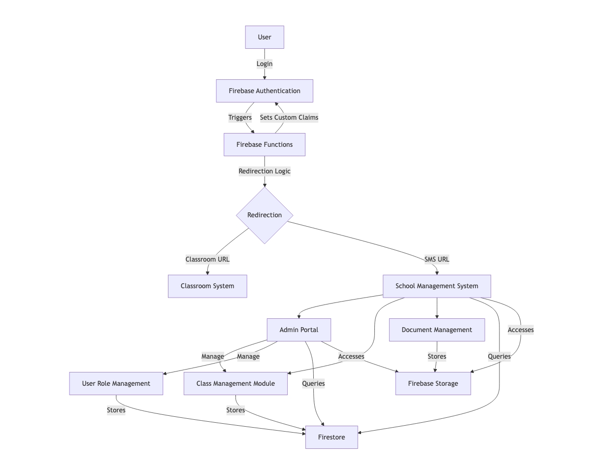
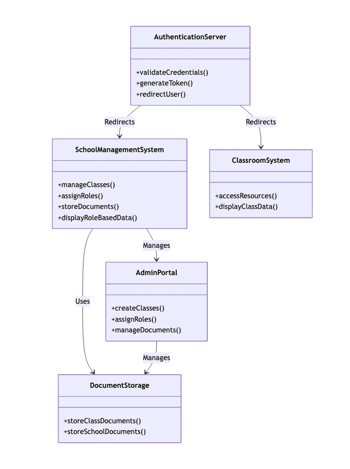
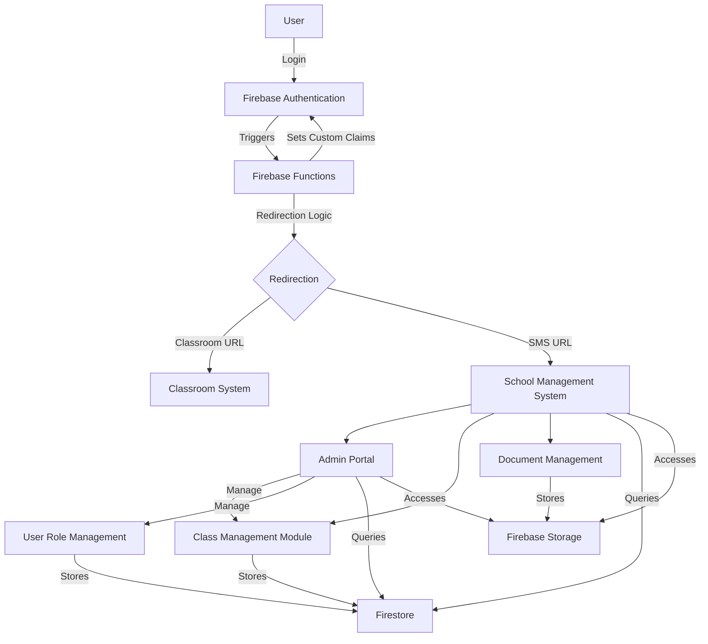

## School Management System Firebase Architecture
### Overview
The School Management System (SMS) is built using Firebase to leverage its authentication, real-time database, and storage capabilities. The system integrates with the existing Mahita Classroom System and uses Firebase Authentication for user login, Firestore for data storage, and Firebase Storage for document management. The architecture supports role-based access for students, teachers, and admins, with a dynamic redirection mechanism post-authentication.

### Firebase Resources Utilized
 - Firebase Authentication: Manages user login and session tokens.
 - Firestore: Stores user roles, class data, and school metadata.
 - Firebase Storage: Stores class-specific and school-level documents.
 - Firebase Hosting: Hosts the SMS and Admin Portal web applications.
 - Firebase Functions: Handles server-side logic for redirection and role validation.

### System Components
 - Firebase Authentication:
    -  Validates user credentials (email/password or other providers).
    - Generates JWT tokens for session management.
    - Triggers Firebase Functions for custom redirection logic.


### School Management System (SMS):
 - Hosted on Firebase Hosting as a React-based web app.
 - Interacts with Firestore for class and user role management.
 - Uses Firebase Storage for document uploads/downloads.
 - Displays role-based data (student, teacher, or admin views).

### Classroom System:
 - Existing system integrated via Firebase Authentication.
 - Receives redirected users post-login.

### Admin Portal:
 - Separate React app hosted on Firebase Hosting.
 - Allows admins to manage classes, assign roles, and upload school documents.
 - Uses Firebase Authentication for secure access.


### Firestore:
 - Stores collections for Users, Classes, Roles, Schools, ClassDocuments, and SchoolDocuments.
 - Supports real-time updates for class and role changes.


### Firebase Storage:
 - Stores class-specific documents (e.g., assignments) and school-level documents (e.g., policies).
 - Secured with Firebase Security Rules to restrict access by role.


### Firebase Functions:
 - Handles post-authentication redirection based on user role and source system (SMS or Classroom).
 - Validates custom claims for role-based access.

### High-Level Architecture Diagram
The diagram illustrates the interaction between users, Firebase services, and the SMS components, emphasizing the role of Firebase in authentication, data storage, and document management.


### High level redirection



### Firestore Data Model
The Firestore collections are designed to support the SMS requirements, with security rules to enforce role-based access.


### Security Rules
Firebase Security Rules ensure data and file access is restricted by user role:
### Firestore:
 - Only admins can modify Classes, Roles, and Schools.
 - Students can read their enrolled Classes and ClassDocuments.
 - Teachers can read/write ClassDocuments for their assigned classes.

### Firebase Storage:
 - Admins have full access to all documents.
 - Students can read class documents; teachers can read/write class documents.
 - School documents can be avaiable to all the students but few documents are admin-only.

#### Example Firestore Security Rules:
```
rules_version = '2';
service cloud.firestore {
  match /databases/{database}/documents {
    match /Users/{uid} {
      allow read: if request.auth != null && request.auth.uid == uid;
      allow write: if request.auth != null && request.auth.token.roleType == 'admin';
    }
    match /Classes/{classId} {
      allow read: if request.auth != null && (request.auth.token.roleType == 'admin' || exists(/databases/$(database)/documents/StudentClasses/$(classId + '_' + request.auth.uid)));
      allow write: if request.auth != null && request.auth.token.roleType == 'admin';
    }
    match /ClassDocuments/{documentId} {
      allow read: if request.auth != null && (request.auth.token.roleType == 'admin' || exists(/databases/$(database)/documents/StudentClasses/$(resource.data.classId + '_' + request.auth.uid)));
      allow write: if request.auth != null && (request.auth.token.roleType == 'admin' || exists(/databases/$(database)/documents/TeacherClasses/$(resource.data.classId + '_' + request.auth.uid)));
    }
  }
}
```
#### Example Firebase Storage Security Rules:
```
rules_version = '2';
service firebase.storage {
  match /b/{bucket}/o {
    match /classDocuments/{classId}/{allPaths=**} {
      allow read: if request.auth != null && (request.auth.token.roleType == 'admin' || exists(/databases/(default)/documents/StudentClasses/$(classId + '_' + request.auth.uid)));
      allow write: if request.auth != null && (request.auth.token.roleType == 'admin' || exists(/databases/(default)/documents/TeacherClasses/$(classId + '_' + request.auth.uid)));
    }
    match /schoolDocuments/{schoolId}/{allPaths=**} {
      allow read, write: if request.auth != null && request.auth.token.roleType == 'admin';
    }
  }
}
```

## System Flow
### User Login:
 - Users log in via Firebase Authentication (email/password or other providers).
 - Firebase Functions validate the user and set custom claims (e.g., roleType: 'student').


### Redirection:
 - Firebase Functions determine the redirection URL (SMS or Classroom System) based on the source system and user role.
 - Users are redirected to the appropriate Firebase-hosted app.


## Role-Based Access:
 - The SMS queries Firestore to fetch user-specific data (e.g., enrolled classes for students).
 - Firebase Security Rules ensure data access aligns with user roles.


## Document Management:
 - Class and school documents are uploaded to Firebase Storage.
 - Firestore stores metadata (e.g., storagePath) for each document.


## Admin Operations:
 - Admins use the Admin Portal to create classes, assign roles, and manage documents.
 - Firebase Functions handle complex logic (e.g., bulk role assignments).

## Notes
 - Scalability: Firestore and Firebase Storage scale automatically, supporting real-time updates and large file storage.
 - Security: Custom claims in Firebase Authentication and Security Rules ensure robust access control.
 - Frontend: The SMS and Admin Portal use React with Tailwind CSS, hosted on Firebase Hosting for fast deployment.

## Assumptions:
 - The Classroom System is already integrated with Firebase Authentication.
 - Firebase Functions are used minimally to reduce latency.
 - All documents are stored in Firebase Storage with Firestore metadata for efficient retrieval.